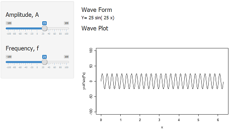

## Introduction

- Objective: Exploring Sine Wave
- Audience: Elementary School Math Students
- Project for Coursera Developing Data Products course 

--- #slide1

## The Math and R Code

A Sine Wave has a mathematical equation that looks like: 
$y = A*sin(f*x)$

- Amplitude, A, controls how "big" or "tall" the wave is
- Frequency, f, controls how "fast" or "frequent" the wave looks

The following R code was used to generate the sine wave:

```r
sineWave <- function(a,b,x) {
        a*sin(b*x)
}
```

---

## Simulation

- Interactive Application can be found on: https://kyletankl.shinyapps.io/example001
- Amplitude and Frequency can be controlled



---

## Summary

- This is meant as a quick and easy practice on using slidify
- It is used together with the companion application
- Slidify was used to embed Math, R code, images and URL in the slides
